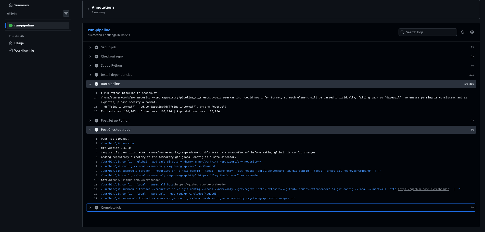
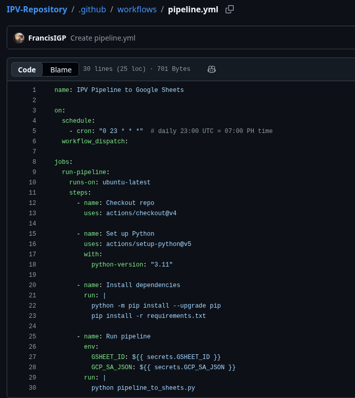

# IPV Dynamic Dashboard - IEMOP Reserve Market

This repository contains a zero-cost, automated data pipeline that collects Philippine IEMOP reserve market clearing price data, appends it to a live Google Sheet, and powers a Tableau Public dashboard that updates without manual file uploads.

## Project Goal
This project aims to make Philippine electricity reserve market pricing more transparent and easier to monitor through a live dashboard, helping users track trends and potential price spikes over time.

## Pipeline Overview
GitHub Actions, Python scraper, Google Sheets storage, Tableau Public dashboard refresh

## Live Links
- [Google Sheet (Data Store)](https://docs.google.com/spreadsheets/d/1jyvx2Jh8jGOVpKoJ9tw1auh-thOSdRAVYVpUjhb3kMM/edit?gid=1648105924#gid=1648105924)
- [Tableau Public Dashboard](https://public.tableau.com/views/IEMOPDashboard/Sheet1?:language=en-US&:sid=&:redirect=auth&:display_count=n&:origin=viz_share_link), Work in Progress

## Proof of Automation
GitHub Actions run proof and workflow file

## Database Update Schedule
The live Google Sheet database is updated automatically via GitHub Actions on a daily schedule.

- Schedule, `0 23 * * *` (cron)
- Runs at, 23:00 UTC daily, which is 07:00 Philippine time (PHT) daily
- What updates, the pipeline appends new rows to the Google Sheet `data` tab and updates the `metadata` timestamp

## Data Source
IEMOP Market Data (RTD reserve market clearing price)  
https://www.iemop.ph/market-data/rtd-reserve-market-clearing-price/
